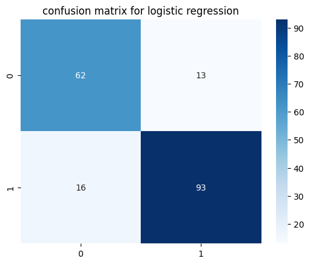
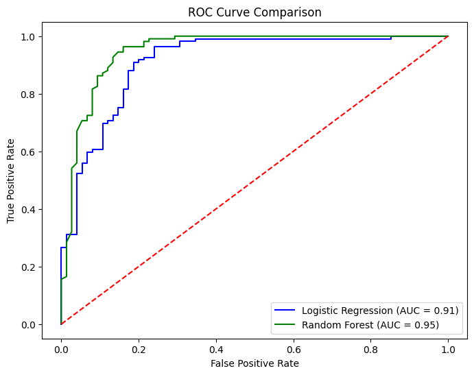

# Disease Prediction Toolkit

This project uses machine learning models to predict diseases (like heart disease/diabetes) using healthcare datasets.  
It compares Logistic Regression and Random Forest models based on performance metrics.

## Dataset
- Source: [Heart Disease UCI Dataset](https://www.kaggle.com/ronitf/heart-disease-uci)  
- Features: age, sex, chest pain type, blood pressure, cholesterol, etc.  
- Target: Presence of disease (1 = yes, 0 = no)

## Steps
1. Data preprocessing (handling missing values, encoding categorical features, scaling)  
2. Model training (Logistic Regression, Random Forest)  
3. Model evaluation (accuracy, precision, recall, F1-score, ROC-AUC)  
4. Visualization (confusion matrix, ROC curve)  

## Results
- Logistic Regression Accuracy: 84.23%  
- Random Forest Accuracy: 88.58%
- 
Confusion Matrix (Logistic Regression):  
  

Confusion Matrix (Random Forest):  
  

ROC Curve Comparison:  
  

**Best Model:** Random Forest (higher accuracy & F1-score)

## Demo
## Demo
🎥 [Watch the Demo](demo/demo.mp4)

## Presentation
- [5-slide PPT](presentation/Disease_Prediction_Presentation.pptx)

